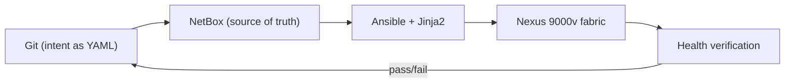
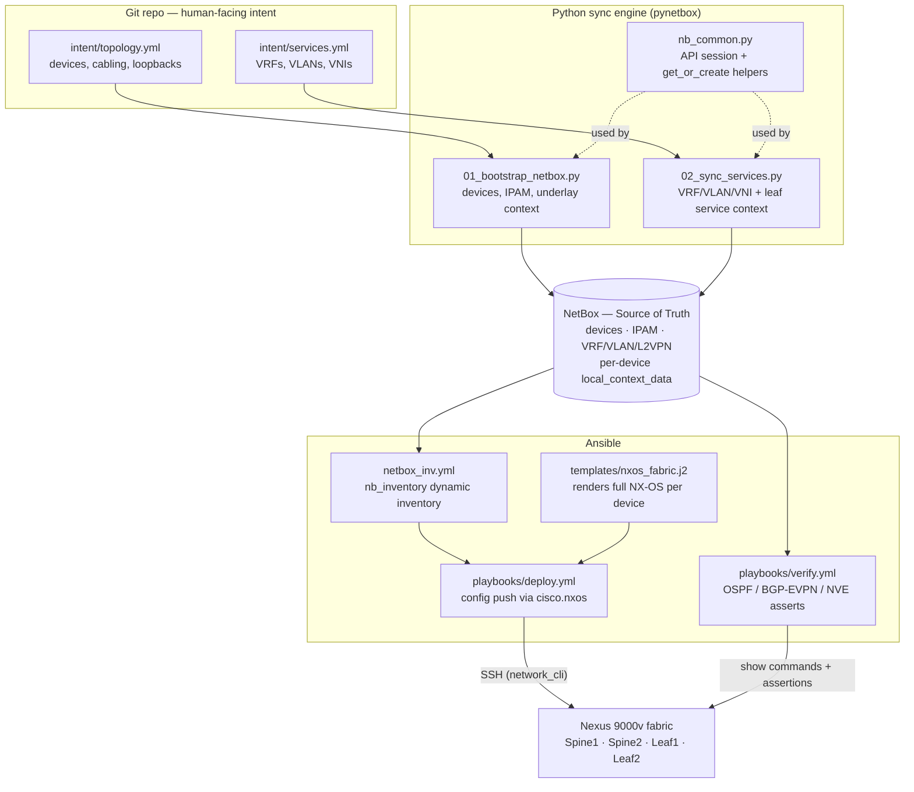
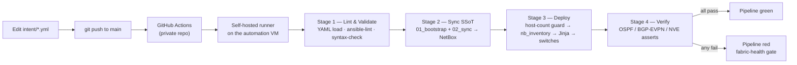

# EVPN-VXLAN Fabric Automation — GitOps with NetBox as Source of Truth
 
A GitOps pipeline that treats **NetBox** as the single source of truth for a Cisco Nexus **EVPN-VXLAN** data-center fabric. Network intent is declared as YAML in Git; a CI/CD pipeline syncs it into NetBox, renders Cisco NX-OS configuration with Jinja2, deploys it to the switches, and verifies fabric health (OSPF, BGP-EVPN, VXLAN) before passing. A commit that would break the fabric fails the pipeline instead of breaking the network.
 

 
## Tech stack
 
- **Fabric:** Cisco Nexus 9000v (NX-OS), 2-spine / 2-leaf Clos topology in **GNS3**
- **Source of truth:** **NetBox** (IPAM + DCIM), deployed via Docker
- **Automation:** **Ansible** (`cisco.nxos`, `netbox.netbox`), **Jinja2** templating
- **Sync engine:** **Python** + **pynetbox**
- **CI/CD:** **GitHub Actions** with a self-hosted runner
- **Overlay/underlay:** OSPF underlay, iBGP EVPN overlay with route reflectors, VXLAN with distributed anycast gateway
---
 
## Table of Contents
 
1. [Why this exists](#why-this-exists)
2. [Architecture](#architecture)
3. [Lab topology](#lab-topology)
4. [Lab environment & addressing](#lab-environment--addressing)
5. [EVPN-VXLAN design](#evpn-vxlan-design)
6. [Repository layout](#repository-layout)
7. [How a change flows end to end](#how-a-change-flows-end-to-end)
8. [The CI/CD pipeline](#the-cicd-pipeline)
9. [The GitOps loop in action](#the-gitops-loop-in-action)
10. [Design decisions & trade-offs](#design-decisions--trade-offs)
11. [Notable engineering challenges](#notable-engineering-challenges)
12. [Roadmap](#roadmap)
 
---
 
## Why this exists
 
In a traditional network the "source of truth" is whatever happens to be running on the switches, plus spreadsheets and tribal knowledge. That doesn't scale and it drifts. A manual change gets made, nobody documents it, & the network & its documentation diverge.
 
This project inverts that with two ideas:
 
- **Single Source of Truth (SSoT):** NetBox holds the *intended* state. Every device, interface, IP, VRF, VLAN, and VLAN-to-VNI mapping in a relational database that enforces correctness (for example, it refuses to assign the same IP twice). Switches are never configured by hand.
- **GitOps:** the *input* to that source of truth is declarative YAML in Git. Every change is a reviewable, revertible, auditable commit, and a pipeline reconciles Git → NetBox → switches automatically.
The result: configuration drift is eliminated by keeping documentation (NetBox) and running state (the switches) in sync through automation, and every network change becomes a peer-reviewable, testable Git commit. Hand-editing config for 4 switches is tedious; for 400 it's an outage waiting to happen. NetBox plus a pipeline is what makes that tractable.
 
---
 
## Architecture
 

 
NetBox sits between declarative intent and the devices: Git is what humans edit, NetBox is the validated relational projection of that intent, and Ansible turns NetBox state into running configuration and then verifies it.
 
---
 
## Lab topology
 
 

*The full GNS3 fabric: a 2-spine / 2-leaf Clos design on Cisco Nexus 9000v with an out-of-band management network bridged to the automation host.*
 
**Reading the topology:**
 
- **Spine1 / Spine2** — the backbone. Every leaf connects to every spine, so any leaf is one hop from any other. Spines run the underlay IGP and act as **BGP route reflectors** for the overlay. They are not VTEPs, they only forward encapsulated packets and reflect routes.
- **Leaf1 / Leaf2** — the access tier and the **VTEPs** (VXLAN Tunnel Endpoints). They terminate endpoints, own the distributed anycast gateway, and perform VXLAN encap/decap.
- **Endpoint1 / Endpoint2** — test hosts on `Ethernet1/3` of each leaf, both in VLAN 10. End-to-end ping between them is the data-plane proof that traffic crosses the VXLAN fabric.
- **MGT-SW1** — the management switch; every device's `mgmt0` connects here, forming an **out-of-band management network** fully separate from the data-plane links.
- **Cloud (vmnet1)** — bridges the GNS3 management segment to a VMware host-only network so the automation host can SSH to every `mgmt0`.
Two planes are deliberately separated: the **data plane** (`Ethernet1/x` spine-leaf links carrying underlay + VXLAN overlay) and the **management plane** (`mgmt0` → MGT-SW1 → Cloud → automation host). Out-of-band management means a switch stays reachable even if a bad config push breaks the data plane.
 


*Data-plane proof: Endpoint1 reaching Endpoint2 across the fabric, with traffic VXLAN-encapsulated between the leaf VTEPs.*
 
---
 
## Lab environment & addressing
 
Everything runs on a single Linux Mint laptop.
 
| Component | Where it runs | Role |
|---|---|---|
| GNS3 | Natively on the laptop | Hosts the virtual Nexus 9000v fabric |
| VMware Workstation | Natively on the laptop | Hosts the automation VM |
| Rocky Linux 10 VM (`AnsibleNode`) | Inside VMware Workstation | Runs Ansible, the Python sync scripts, NetBox (Docker), and the GitHub Actions self-hosted runner |
 


The automation VM has **two NICs**: a **NAT** interface for outbound internet (packages, Docker images, `github.com`) and a **host-only (vmnet1)** interface for the lab management network `192.168.100.0/24`, shared with the GNS3 Cloud node. The self-hosted runner reaches GitHub *outbound* over NAT and the switches over host-only, so no inbound firewall exposure into the lab is required.
 
**Addressing plan:**
 
| Plane | Range | Notes |
|---|---|---|
| Management (vmnet1) | `192.168.100.0/24` | Automation host `.10`; Spine1 `.21`, Spine2 `.22`, Leaf1 `.23`, Leaf2 `.24` |
| Underlay P2P links | `10.1.1.0/31` blocks | OSPF area 0, point-to-point |
| Loopback0 (router-id / BGP) | `10.0.0.x/32` | Spine1 `.1`, Spine2 `.2`, Leaf1 `.3`, Leaf2 `.4` |
| Loopback1 (VTEP / NVE source) | `10.100.0.x/32` | Leaves only: Leaf1 `.3`, Leaf2 `.4` |
| Tenant subnets | `10.1.10.0/24`, `10.1.20.0/24`, … | Anycast gateway `.1` on every leaf |
 
**Build phases:** the lab was built in deliberate layers, each verified before the next — (1) topology + out-of-band management, (2) NetBox + the intent YAML schema, (3) the pynetbox sync engine, (4) Ansible dynamic inventory + Jinja2 templating, (5) the GitHub Actions pipeline, (6) automated verification.
 
---
 
## EVPN-VXLAN design
 
### Underlay + overlay
 
EVPN-VXLAN is two independent networks stacked together:
 
- **Underlay** — plain IP reachability between switches. Its only job is to let every VTEP loopback reach every other VTEP loopback. This uses **OSPF** in area 0 over `/31` point-to-point links, carrying nothing but loopbacks and transit links.
- **Overlay** — the tenant networks, carried *inside* VXLAN tunnels and advertised by **BGP EVPN**, riding on top of underlay reachability.
Separating them decouples "can the boxes reach each other" from "what tenants/VLANs exist." Tenants and MAC addresses can be added to the overlay without touching the underlay at all.
 
### VXLAN
 
VXLAN wraps an Ethernet frame inside a UDP/IP packet (MAC-in-UDP) tagged with a 24-bit **VNI** — giving ~16 million segments versus ~4,094 usable VLANs, and letting an L2 segment stretch across an L3 fabric. The leaves performing encap/decap are **VTEPs**, sourced from `Loopback1`.
 
### EVPN — a BGP control plane instead of flood-and-learn
 
Classic VXLAN floods to learn MAC addresses. EVPN replaces that with BGP: each leaf advertises the MACs and IPs it learns locally, so remote leaves learn them without flooding. The route types used here:
 
- **Type-2 (MAC/IP advertisement):** host reachability — each host appears as a MAC-only route and a MAC+IP route.
- **Type-3 (Inclusive Multicast):** per-VNI VTEP discovery for BUM traffic. This design uses **ingress replication** over BGP rather than multicast in the underlay (no PIM required).
- **Type-5 (IP Prefix):** routed prefixes for inter-subnet/external routing.

*EVPN control-plane learning in one screen: a locally-attached host shows as `Local`, while the host behind the other leaf is learned via `BGP` with the remote VTEP as next-hop.*
 
### iBGP with route reflectors
 
The overlay runs **iBGP in a single AS (65001)**. Because iBGP requires a full mesh (`n(n-1)/2` sessions), the spines act as **route reflectors**: leaves peer only with the spines, which reflect EVPN routes between leaves. A new leaf adds two sessions (one per spine) instead of one per existing leaf. (An eBGP-everywhere design with a unique AS per device is the common hyperscaler alternative; this lab uses OSPF + iBGP + RR for clarity.)
 
### Distributed anycast gateway
 
Every leaf hosts the **same** SVI IP and anycast MAC for a given subnet (e.g. `10.1.10.1` on both leaves), so a host's default gateway is always local to its leaf — first-hop routing happens on the directly-connected switch with no hair-pinning. A workload can move between leaves without its gateway IP or MAC changing.
 
> One consequence worth knowing: because the anycast gateway IP is identical on every leaf, a remote-host ping sourced *from* a leaf's anycast SVI will not return (the remote leaf answers locally, owning the same IP). Host-to-host traffic works normally; switch-sourced testing must use a unique per-leaf loopback. This is why verification relies on control-plane assertions rather than a leaf-sourced data-plane ping.
 
### Tenancy: VRF, L2VNI, L3VNI
 
- A **VRF** (`TENANT1`) provides multi-tenancy — an isolated routing table with reusable IP space.
- **L2VNIs** (e.g. VNI 10010 ↔ VLAN 10) stretch a single L2 segment across the fabric.
- An **L3VNI** (VNI 50001, VLAN 999) is the transit VNI for **symmetric IRB** — inter-subnet routing is sent into the L3VNI, carried across the fabric, and routed out at the egress leaf.

*Overlay health: BGP L2VPN EVPN sessions Established to both route-reflector spines, and active NVE (VXLAN tunnel) peers between the leaf VTEPs.*
 
---
 
## Repository layout
 
```
evpn-vxlan-gitops/
├── README.md
├── requirements.txt              # Python deps for the pipeline venv
├── intent/
│   ├── topology.yml              # devices, cabling, loopbacks  (rarely changes)
│   └── services.yml              # VRFs / VLANs / VNIs           (the GitOps "knob")
├── scripts/
│   ├── nb_common.py              # pynetbox session + get_or_create helpers (shared)
│   ├── 01_bootstrap_netbox.py    # writes devices, interfaces, IPAM, underlay context → NetBox
│   └── 02_sync_services.py       # writes VRFs/VLANs/VNIs + per-leaf service context → NetBox
├── ansible/
│   ├── ansible.cfg               # inventory path, connection timeouts, fail-on-unparsed-inventory
│   ├── collections.yml           # cisco.nxos, netbox.netbox, ansible.netcommon
│   ├── inventory/
│   │   ├── netbox_inv.yml         # NetBox dynamic inventory (nb_inventory) config
│   │   └── group_vars/all.yml     # NX-OS connection vars (network_cli, creds)
│   ├── templates/
│   │   └── nxos_fabric.j2         # single template, branches on spine/leaf role
│   └── playbooks/
│       ├── deploy.yml             # render from NetBox + push config
│       └── verify.yml             # assert OSPF / BGP-EVPN / NVE health
└── .github/workflows/
    └── deploy.yml                 # the CI/CD pipeline
```
 
**What each script does:**
 
- **`nb_common.py`** — shared library that builds the authenticated `pynetbox` session and exposes a `get_or_create(endpoint, search, defaults)` helper, making both sync scripts idempotent (re-running converges to the same NetBox state).
- **`01_bootstrap_netbox.py`** — the physical/underlay model. Reads `intent/topology.yml` and creates the site, device types, roles, the four devices, their interfaces and IPs (via NetBox IPAM, which enforces no-duplicate-IPs), and computes each device's `local_context_data` blob (router-id, ASN, loopbacks, underlay neighbors, route-reflector list). Rarely re-run after the fabric is wired.
- **`02_sync_services.py`** — the service model the GitOps loop exercises constantly. Reads `intent/services.yml`, creates the VRF, VLANs, VLAN-to-VNI mappings (NetBox L2VPN objects) and tenant prefixes, then refreshes the service portion of each leaf's `local_context_data` (SVIs, L2VNIs, L3VNI).
- **`nxos_fabric.j2`** — one template rendering a complete NX-OS config per device, branching on `config_context.role`. Spines get underlay OSPF + BGP route-reflector config; leaves additionally get the anycast gateway, VLAN/VNI/SVI config, the NVE (VTEP) interface, EVPN route-targets, and access ports. It always renders the management baseline so a push can't cause lockout.
- **`deploy.yml`** — renders the template per host from its NetBox `config_context` and applies it with `cisco.nxos.nxos_config` over an SSH `network_cli` connection.
- **`verify.yml`** — runs `show` commands and asserts on them: OSPF must be FULL, no BGP-EVPN session may be down, and every leaf must have at least one NVE peer.

*NetBox as the source of truth: the four devices with their roles and primary management IPs (the primary IP becomes Ansible's `ansible_host`).*
 
---
 
## How a change flows end to end
 
The path a change takes from an edit to a switch:
 
1. **Edit `intent/services.yml`** (e.g. add a VLAN) and `git push`.
2. **`02_sync_services.py` writes that intent into NetBox**, which validates it (IPAM rejects conflicts) and stores it relationally.
3. **Ansible's `nb_inventory` plugin queries the NetBox API**, gets the devices grouped by role (`spine`/`leaf`), and pulls each device's `config_context` plus its **primary IP**, which becomes `ansible_host` — that's how Ansible knows which IP to SSH to.
4. **`nxos_fabric.j2` renders a full NX-OS config** per device from that context.
5. **`deploy.yml` pushes the rendered config** to each switch over SSH.
6. **`verify.yml` proves the result** with `show bgp l2vpn evpn summary`, `show ip ospf neighbors`, `show nve peers`, and assertions on each.
The relational model in NetBox (which enforces correctness) is projected into a flat, render-friendly `local_context_data` blob per device; `nb_inventory` exposes it as `config_context`, and the Jinja template consumes it directly — so NetBox enforces the truth while the blob keeps templating simple.
 

*NetBox IPAM: tenant prefixes and per-interface IP assignments. Duplicate-IP rejection here is what makes NetBox a trustworthy source of truth.*
 
---
 
## The CI/CD pipeline
 

 
A **self-hosted runner** is used because GitHub's cloud runners cannot reach a fabric inside a private lab. The runner polls GitHub outbound (no inbound exposure) and, when a job arrives, runs locally — reaching NetBox on `localhost` and the switches over the management network. The repository is **private**, because a self-hosted runner attached to a public repo is a security risk (a forked PR could execute code on a machine inside the network).
 
| Stage | What it does | Why it matters |
|---|---|---|
| 1 — Lint & Validate | Parses intent YAML, runs `ansible-lint`, runs an Ansible `--syntax-check` | Catch typos before they touch NetBox or a switch |
| 2 — Sync SSoT | Runs both Python scripts to reconcile Git → NetBox | NetBox reflects the new intent |
| 3 — Deploy | Asserts the inventory returned > 0 hosts, then renders and pushes config | The host-count guard prevents a "green but did nothing" false success |
| 4 — Verify | Asserts OSPF FULL, BGP-EVPN Established, NVE peers up | A commit that would break the fabric turns the pipeline red |
 
A guard worth highlighting: Ansible exits 0 when no hosts match, so a broken inventory can produce a *green* pipeline that silently configured nothing. The pipeline sets `unparsed_is_failed = True` in `ansible.cfg` (an unparsable inventory is fatal) and asserts in Stage 3 that NetBox returned more than zero hosts.
 

*A full pipeline run: lint → sync → deploy → verify, all green.*
 

*Proof the pipeline configures real devices: `NetBox inventory returned 4 hosts`, followed by a `changed` result on each switch.*
 
---
 
## The GitOps loop in action
 
Adding a tenant VLAN to the entire fabric is **one line and a push** — no switch login:
 
1. Add a line to `intent/services.yml`:
```yaml
   - {id: 30, name: DB, vni: 10030, vrf: TENANT1, svi_ip: 10.1.30.1, svi_mask: 24, prefix: 10.1.30.0/24}
```
2. `git commit -m "Add DB VLAN 30 / VNI 10030" && git push`
3. The pipeline validates → writes VLAN 30 / VNI 10030 into NetBox (IPAM checks for conflicts) → re-renders every leaf from NetBox and pushes config → verifies BGP/NVE health.
4. If any switch's health check fails, the pipeline goes red before the change can become an outage.

*The whole loop in one image: a VLAN added in a Git commit appears in `show vlan` on the leaf — with no manual switch configuration.*
 
---
 
## Design decisions & trade-offs
 
- **NetBox as SSoT vs. flat YAML in Ansible `host_vars`** — flat files work for a handful of switches and fall apart at scale (copy-paste errors, duplicate IPs, no validation). NetBox provides relational integrity, IPAM conflict detection, and a queryable API, at the cost of an additional service to run.
- **Config merge vs. `configure replace`** — declarative `configure replace` would give true anti-drift, but NX-OS requires the candidate to be a *complete* running-config (it rejects a file missing the `version` header, `vlan 1`, and the auto-generated `snmp-server user admin` line, which carries device-specific hashes that can't be templated). A hand-rolled partial template is therefore valid for a merge but not a clean replace. The path to true anti-drift on NX-OS is the resource modules (`nxos_vlans`, `nxos_bgp_global`, …) with `state: overridden` — see Roadmap.
- **`local_context_data` (rendered intent blob) vs. pure native-object lookups** — the relational truth is stored as native NetBox objects (VRF/VLAN/L2VPN/IPAM, so IPAM validation is real), and a clean per-device JSON blob is projected for templating. This keeps the Jinja template simple while NetBox still enforces correctness.
- **OSPF underlay + iBGP overlay + RR vs. eBGP everywhere** — the iBGP+RR pattern is chosen for clarity; eBGP-everywhere is the common hyperscaler alternative.
- **Self-hosted runner vs. GitHub-hosted** — required, since only a runner inside the network can reach the lab; the trade-off is owning the runner's security (private repo, outbound-only).
---
 
## Notable engineering challenges
 
A few non-obvious problems solved while building this, with their root causes:
 
- **Nexus 9000v management interface had no link** — `mgmt0` was admin-up but showed `Active connector: Link Down` with zero RX. Root cause: the Nexus 9000v only supports the **`e1000`** QEMU adapter type; the wrong NIC model meant no interface ever got carrier.
- **NetBox `config_context` arrives as a list, not a dict** — the `nb_inventory` plugin returns it as a single-element list, so the template normalizes it by merging into a dict using a Jinja2 `namespace` object (variables set inside a `` loop don't survive the loop).
- **`configure replace` pre-check failure** — NX-OS rejected a partial candidate config (missing `version`, `vlan 1`, `snmp-server user admin`), confirming replace requires a complete running-config. It failed before applying, leaving the fabric untouched.
- **A "green but did nothing" pipeline** — a missing `pytz` dependency made the NetBox inventory plugin fail silently and fall back to localhost; the deploy reported "no hosts matched" yet exited 0. Fixed by adding the dependency and by asserting the inventory returns more than zero hosts.
- **Self-hosted runner wouldn't start under systemd** — exit `203/EXEC` on Rocky Linux because SELinux blocks systemd from executing scripts under `/home`; relocating the runner to `/opt` and relabeling resolved it.
- **NetBox API token rejected (`Invalid v1 token`)** — NetBox 4.5+ introduced a new v2 token format; the client uses the legacy header, so a v1 token had to be created explicitly.
---
 
## Roadmap
 
- **True anti-drift via resource modules** — replace the merge-from-template deploy with `cisco.nxos` resource modules (`state: overridden`) for per-resource drift removal and genuine idempotency.
- **Secrets management** — move switch credentials and the NetBox token to HashiCorp Vault or SOPS-encrypted vars.
- **Data-plane testing in CI** — automated host-to-host reachability (or leaf pings sourced from unique per-leaf VRF loopbacks) so the pipeline proves forwarding, not just control-plane health.
- **Pull-request CI** — run lint + dry-run (`--check`) on PRs so review happens before anything reaches `main`.
- **Scale-out & multi-site** — EVPN multi-site / DCI and NetBox config contexts keyed by site/role.
- **Observability** — stream telemetry to a dashboard rather than pass/fail asserts.